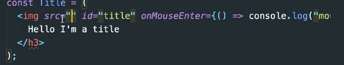
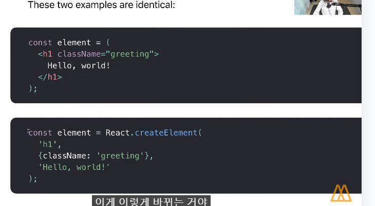
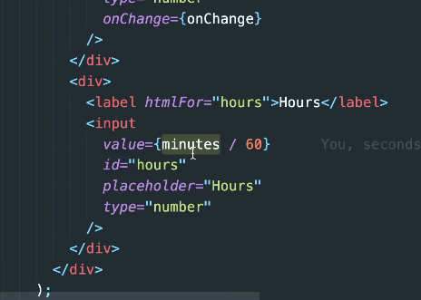
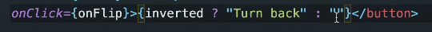
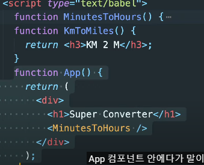
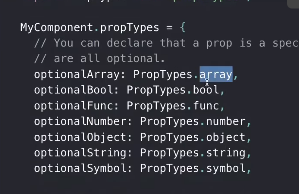

# React

### click button 생성하기

```html
<!DOCTYPE html>
<html>

<body>
<span>Total clicks: 0</span>
<button id="btn">Click me</button>


</body>
<script>
    let counter = 0;
    const button =document.getElemetnById("btn");
const span = document.querySelector("span");

    function handleClick() {
    console.log("i have been clicked!)
    counter = counter + 1;
    span.innerText = 'Total clicks': `${counter}`;
}
button.addEventListener("click", handleClick);
</script>
</html>
```

1. HTML 만들고 

2. javascript가져오고 

3. 이벤트감지 

4. 데이터업데이트

5. Html업데이트

이런방식은 계속 eventLister를 달고  핸들클릭을 계속만들어서  복잡해지고 알아보기 힘들어진다.

위의 형식처럼 안하기위해서 react-dom이 필요하고 rectdom은 lib와 package이다 body안에 element 속성을 넣어줌

### 이 클릭 버튼을 Vanila js로 만들어보기

리액트 가져오기

index.html

```html
```html
<!DOCTYPE html>
<html>

<body>
 <div id="root"></div>
    <span></span>
</body>
<script src="https://unpkg.com/react@17.0.2/umd/react.production.min.js"></script>
<script src ="https://unpkg.com/react-dom@17.0.2/umd/react-dom.production.min.js"></script>
<script>

    const root =document.getElementById("root");
    const h3 =React.createElement("h3", { id: "title",
    onMouseEnter: () => console.log("mouse enter"),}, "Hello Im a title");
    const span = React.createElement("span"유효한 html속성이 면 어떤것도 가능
,     {id:"sexy-span"}style도 넣을 수 있음 style : {color:'red'},
     "Hello I'm a span"보여주기위한 id); 
여기에는 내가 생성하고자하는 html속과 같아야함
    const btn = React.createElement("button",{
onClick: () => console.log("im Clicked"), style: {
    backgroundColor:"tomato",

}, "Click me");
    const container = React.createElement("div", null, [h3, btn]);
    ReactDOM.render(span, root);
</script>
</html>
```

```
- 리액트를 가져오기위해선 react와 react dom을 import해야함

- 각각의 element는 content와 property를 가지고 있다.


## JSX

> javascript를 확장한 문

```html
<!DOCTYPE html>
<html>

<body>
 <div id="root"></div>
    <span></span>
</body>
<script src="https://unpkg.com/react@17.0.2/umd/react.production.min.js"></script>
<script src ="https://unpkg.com/react-dom@17.0.2/umd/react-dom.production.min.js"></script>
<script>

    const root =document.getElementById("root");
    **const Title = <h3 id="title" onMouseEnter={() => console.log("mouse enter")}>
        Hello I,m a title</h3>**);
    const Button = <button style={{ backgroundColor: "tomato",}}
         onClick{() => console.log("im clicked")}>Click me</button>
    const span = React.createElement("span"유효한 html속성이 면 어떤것도 가능
,     {id:"sexy-span"}style도 넣을 수 있음 style : {color:'red'},
     "Hello I'm a span"보여주기위한 id); 
여기에는 내가 생성하고자하는 html속과 같아야함
    const container = React.createElement("div", null, [h3, btn]);
    ReactDOM.render(span, root);
</script>
</html>
```

> img 가있을 시 h3를 지우고 img src=""



- 에러 발생시 브라우저가 jsx를 올바르게 이해못해서 발생함 이를변환하기 위해선 아래 코드를 그 아래의 코드로 변환시켜줘야함 이를 __바벨__ 이라고함



### jsx 바벨 변환작업

```html
const Title = /*#__PURE__*/React.createElement("h3", {id: title", onMouseEnter: () => console.log("mouse enter")
}, "Hello I'm a title");
```

> 또한 src="https://unpkg.com/@babel/standalone/babel.min.js"

> type="text/babel"

> const container = React.createElement("div", null, [h3, btn]); 이후 이코드를
> 
> const container = React.createElement("div", null, [Title,  button]); 이렇게 일치시켜줘야함

### JSX2

```html
<!DOCTYPE html>
<html>

<body>
 <div id="root"></div>
    <span></span>
</body>
<script src="https://unpkg.com/react@17.0.2/umd/react.production.min.js"></script>
<script src ="https://unpkg.com/react-dom@17.0.2/umd/react-dom.production.min.js"></script>
<script>

    const root =document.getElementById("root");
    **function Title() {
        return (
            <h3 id="title" onMouseEnter={() => console.log("mouse enter")}>
            Hello I,m a title
            </h3>**);
    __const Button = () => ( <button style={{ backgroundColor: "tomato",}}
         onClick{() => console.log("im clicked")}>Click me</button>);__
    const span = React.createElement("span"유효한 html속성이 면 어떤것도 가능
,     {id:"sexy-span"}style도 넣을 수 있음 style : {color:'red'},
     "Hello I'm a span"보여주기위한 id); 
여기에는 내가 생성하고자하는 html속과 같아야함
    const Container = <div><Title /><Button /> => JSX형식 단순글자가아닌 구성을 보여
</div>
    ReactDOM.render(Container, root);
</script>
</html>
```

> 대문자 주의 Container => 소문자는 그냥 html 태그로 헷갈릴수있음
> 
> arrow function 사용

arrow function 이나 return 함수 사용시에도 변환가능

## state

```html
<!DOCTYPE html>
<html>

<body>
<span>Total clicks: 0</span>
<button id="btn">Click me</button>


</body>
<script>
    let counter = 0;
    const button =document.getElemetnById("btn");
const span = document.querySelector("span");

    function handleClick() {
    console.log("i have been clicked!)
    counter = counter + 1;
    span.innerText = 'Total clicks': `${counter}`;
}
button.addEventListener("click", handleClick);
</script>
</html>
```

> DFASD

```html
<!DOCTYPE html>
<html>

<body>
 <div id="root"></div>
    <span></span>
</body>
<script src="https://unpkg.com/react@17.0.2/umd/react.production.min.js"></script>
<script src ="https://unpkg.com/react-dom@17.0.2/umd/react-dom.production.min.js"></script>
<script src ="https://unpkg.com/@babel/stanalone/babel.min.js"></script>
<script type="text/babel"></script>
<script>
    const root =document.getElementById("root");
    let counter = 0;
    function countUP() {
    counter = counter + 1;
    render();
}
function render(){
    ReactDOM.render(<Container/>, root);
}
const Container = () => (
      <div>
        <h3>
            Total Clicks: {counter}
        </h3>    
        <button onClick={countUp}>Click me</button>

        </div>
    );
    render();
</script>
</html>
<!-- 바뀐부분 바로 업로드하기위함이필요함 -->
```

바로 리렌더링할수 있는 방법이 필요

### state 변환 setState

```html
<!DOCTYPE html>
<html>

<body>
 <div id="root"></div>
    <span></span>
</body>
<script src="https://unpkg.com/react@17.0.2/umd/react.production.min.js"></script>
<script src ="https://unpkg.com/react-dom@17.0.2/umd/react-dom.production.min.js"></script>
<script src ="https://unpkg.com/@babel/stanalone/babel.min.js"></script>
<script type="text/babel"></script>
<script>
    const root =document.getElementById("root");
    let counter = 0;
    function countUP() {
        counter = counter + 1;
        render();
    }
    function App() {
    const data = React.useState()
    const [couter, modifier===setCounter] = React.useState(0);
    const onClick = () => {
    setCounter((Current) => current  +1);


};
    return (
        <div>
            <h3>Total clicks: {data[0]}</h3>
            <button onClick={onClick}>Click me</button>
        </div>
);
}


const Container = () => (
      <div>
        <h3>
            Total Clicks: {counter}
        </h3>    
        <button onClick={countUp}>Click me</button>

        </div>
    );
    render();
</script>
</html>
<!-- 바뀐부분 바로 업로드하기위함이필요함 --> 
```

> 배열의 형식 const [1,2,3] = x
> 
> 배열을 앞에 arr명을 뒤에 한다

### input and state

```html
<script src="https://unpkg.com/react@17.0.2/umd/reat.development.js"></script>


function App() {
    const [minutes, setMinutes] = React.useState()
    const onChange = (event) => {
    console.log(event.target.value);   
    };    
        return (
       <div>
           <h1>Super Converter</h1>
            <label for="minutes">Minutes</label>

            <input value={minutes} id ="minutes" 
                placeholder="Minutes" type="number"
                onChange={onChange} 
                />
            <h4>You want to convert {minutes}</h4>
            <label for="hours">Hours</label>
            <input value= id ="hours" placeholder="Hours" type="number"/>
       </div>
    );
    const root = document.getElementById("root");
    ReactDOM.render(<App />, root);
}
```

> jsx => class는 쓰면 안되고 className, htmlFor로 사용해야함

### State Practice part One

```html
<script src="https://unpkg.com/react@17.0.2/umd/reat.development.js"></script>


function App() {
    const [amount, setAmount] = React.useState(0); => default값
    const [flipped, setFlipped] = React.useState(false);
    const onChange = (event) => {
    console.log(event.target.value);   => event를 여기서 변경해주기에 따로 필요하지않음 리렌딩해
    };
    const reset = () => setAmount(0);
    const onFlip = () => 
    reset();
    setFlipped((current) => !current);
    true는 flase로 false는 true로
        return (

       <div>
           <h1>Super Converter</h1>
            <div>
            <label for="minutes">Minutes</label>

            <input value={flipped ? amount*60 : amount} id ="minutes" 
                placeholder="Minutes" type="number"
                onChange={onChange} 
                disabled={flipped === true}
                />
        </div>
        <div>
            <label for="hours">Hours</label>
            <input value={flipped ? amount: Math.round(minutes/60)}
            id ="hours" 
            placeholder="Hours" 
            type="number"
            disabled={flipped === false}
            onChange={onChange}
            /> =>이는 !flipped와 같다


       </div>
        <button onClick={reset}>Reset</button>
        <button onClick={onFlip}>{p</button>
    </div>
    );
    const root = document.getElementById("root");
    ReactDOM.render(<App />, root);
}  
```



onChange가 없으면 바꿔지지 않는다

> value를 minutes/60을한다 그래야 시간이 되기때문

> 여기서 소수점위로 반올림하기위해
> 
> value={Math.round(minutes/60)}을해줌
> 
> flipped를inverted로 바꿔도됨



turn back 뒤 빈칸 flipped > 유저에게 상태를 보여주기위해서 flip이 되었는지 안되었는지 확인해줌

```html
function MinutesToHours {
    const [amount, setAmount] = React.useState(0); => default값
    const [flipped, setFlipped] = React.useState(false);
    const onChange = (event) => {
    console.log(event.target.value);   => event를 여기서 변경해주기에 따로 필요하지않음 리렌딩해
    };
    const reset = () => setAmount(0);
    const onFlip = () => 
    reset();
    setFlipped((current) => !current);
    true는 flase로 false는 true로
        return (

       <div>
           <h1>Super Converter</h1>
            <div>
            <label for="minutes">Minutes</label>

            <input value={flipped ? amount*60 : amount} id ="minutes" 
                placeholder="Minutes" type="number"
                onChange={onChange} 
                disabled={flipped === true}
                />
        </div>
        <div>
            <label for="hours">Hours</label>
            <input value={flipped ? amount: Math.round(minutes/60)}
            id ="hours" 
            placeholder="Hours" 
            type="number"
            disabled={flipped === false}
            onChange={onChange}
            /> =>이는 !flipped와 같다


       </div>
        <div>
        function App() {
    return ( 
        <MinutesToHours/>
    </div>
    );
    const root = document.getElementById("root");
    ReactDOM.render(<App />, root);
}  
```

**

```html
function MinutesToHours() {

}
function KmToMiles() {

}
function App() {
    const [index, setIndex] = React.useState(0);
    const onSelect = (event) => {
           setIndex(event.target.value);
    };
    console.log("render w/", index); => 0이면 index가 0인
    return (
    <div>
        <h1>Super Converter</h1>
    <select value={index} onChange={onSelect}>
        <option value="xx">Select your units>/option>
        <option value="0"> Minutes & Hours</option>
        <option value="1">Km & Miles</option>
    </select>
    </hr>
        {index === "xx" ? "Please select your units" : null} 
        {index === "0" ? <MinutesToHours /> : null}
        {index === "1" ? <KmToMiles/> : null}
   </div> 
)
}
```

## Props

App 부모 컴포넌트

MinutesTohours/KmToMiles 자식컴포넌트

```html
    function Btn(props) {
    console.log(props);
    return <button style={{
    backgroundColor: "tomato",
    color:"white",
    padding:"10px 20px",
    border: 0,
    borderRadius: 10,
}}>
     {props.banana}
Save Changes</button>;
}
두코드의 차이점
function ConfirmBtn({text, big}) {
    return <button style={{     
    backgroundColor: "tomato",
    color:"white",
    padding:"10px 20px",
    border: 0,
    borderRadius: 10, 
    fontSize: big ? 18 : 16,           
    }}>
       {text}
Confirm</button>;
}
함수형 컴포넌트와 JSX
function App() {
    return <div>
        <Btn banana(text)="Save Change" big={true}/>
        <Btn banana="Continue" big={false}/> => undefined 
    <div/>;
}
const root = document.getElementById("root");
ReactDOM.render(<App/>, root);
```

### Memo

> 같은 상태일때 반복해서 렌더링되지 않기 위해 memorize작업이필요함

```html
    function Btn(props) {
    console.log(props);
    return <button style={{
    backgroundColor: "tomato",
    color:"white",
    padding:"10px 20px",
    border: 0,
    borderRadius: 10,
}}>
     {props.banana}
Save Changes</button>;
}
두코드의 차이점
function ConfirmBtn({text, big, onClick}) {
    onClick을 적지않으면단순한 props에 불과함
    return (
    <div>
    <button 
    onClick={onClick}
    style={{     
    backgroundColor: "tomato",
    color:"white",
    padding:"10px 20px",
    border: 0,
    borderRadius: 10, 
    fontSize: big ? 18 : 16, (래)          
    }}>
       {text}
Confirm</button></div>
);
}
const MevorizedBtn = React.memo(Btn)
Btn.propTypes = {
        text: PropTypes.string.ㅑㄴㄲㄷ벼
        fontSize: PropTypes.number,
    }
함수형 컴포넌트와 JSX
function App() {
    const [value, setValue] = React.useState("Save Changes")
    const changeValue = () => setValue("Revert Changes");
    return (
        <div>
            <MemorizedBtn text={value} onClick={changeValue}/>
            <MemorizedBtn text="Continue"/>
            두번째 continue는 계속 렌더링 되면 안됨 => 이문제를 해결하기 위해 memorize가 필욯마
    <div/>);
}
const root = document.getElementById("root");
ReactDOM.render(<App/>, root);
```

### Prop Types

- fontsize = 18 일경우 fontsize를 props에 넣어줘야함

- text fontsize등 각 프론트를 jsx로 부를때 다르더라도 구문상오류는 나지 않음 하지만 화면상오류로 나타남 > 이러하 문제를 해결하기위해 propstype이라는 패키지를 사용

- <script src="https://unpkg.com/prop-types@15.6.2/prop-types.js"></script>



prop설정 옵션들 


## React-create

npm i prop-types : prop types package를 가져오느것

```html
import Button from "./Button";
import styled from "./Button.module.css";
import styles from "./App.module.css";
;function App() {
  const [counter, setValue] = userState(0);
  const onClick = () => setValue((prev) => prev+1)
  return (
    <div>
      <h1 className={styles.title}>Welcome back!!</h1>
      <Button className={styled.btn} text={"Continue"} />
    </div>
  )
}

export default App;
```

### EFFECTS

```html
// import Button from "./Button";
// import styled from "./Button.module.css";
// import styles from "./App.module.css";
import {useState} from "react";
;function App() {
  const [counter, setValue] = useState(0);
  const onClick = () => setValue((prev) => prev+1)
  console.log('render');
  return (
    <div>
      <h1>{counter}</h1>
      <button onClick={onClick}>click me</button>
    </div>
  )
}

export default App;
```

> useEffect를 사용하면 한번만 실행된다


### useEffect

```html
// import Button from "./Button";
// import styled from "./Button.module.css";
// import styles from "./App.module.css";
import {useState, useEffect} from "react";
;function App() {
  const [counter, setValue] = useState(0);
  const onClick = () => setValue((prev) => prev+1)
  console.log("i Run all the time")
  useEffect(() => {
    console.log("Call the api..")
  } ,[]);

  console.log('render');
  return (
    <div>
      <h1>{counter}</h1>
      <button onClick={onClick}>click me</button>
    </div>
  )
}

export default App;
```

```html
// import Button from "./Button";
// import styled from "./Button.module.css";
// import styles from "./App.module.css";
import {useState, useEffect} from "react";
;function App() {
  const [counter, setValue] = useState(0);
  const [keyword, setkeyword] = useState("")
  const onClick = () => setValue((prev) => prev+1)
  const onChange = (event) => setkeyword(event.target.value);
  console.log("i Run all the time")
  useEffect(() => {
    console.log("Call the api..")
  } ,[]);
  // useEffect(()=> {
  //   if (keyword !== ""&& keyword.length > 5) {
  //     console.log("SEARCH FOR", keyword)
  //   };
  useEffect(()=> {
      console.log("i run when 'counter' changes")
    }, [counter]);
  useEffect(()=> {
      console.log("i run when keyword & counter changes")
    }, [keyword, counter]);
  // 키워드가 바뀔때 이베느발생시킬땜 하려면 저렇게
  // console.log('render')
  return (
    <div>
      <input value={keyword} onChange={onChange} type="text" placeholder="Search here..."/>
      <h1>{counter}</h1>
      <button onClick={onClick}>click me</button>
    </div>
  )
}


export default App;
```


### Cleanup


```html
import {useState, useEffect} from "react";

function Hello() {
  function byFn() {
    console.log("bye :(");
  }
  function effectFn(){
    console.log('created :)');
    return byFn;
  }
  useEffect(() => {
    console.log("hi :)");
    return function(){
      console.log("bye :(");
    };
  }, []);
  // 두코드 비교가 필요
  useEffect(function() {
    console.log("hi :)");
    return function(){
      console.log("bye :(");
    };
  }, []);
  useEffect(effectFn, [])
  return <h1>Hello</h1>
}
function App() {
  const [showing, setShowing] =useState(false);
  const onClick = () => setShowing((prev) => !prev);
  return (<div>
    {showing ? <Hello /> : null}
    <button onClick={onClick}>{showing ? "Hide"  : "Show"}</button>
  </div>
  );
}
export default App;
```

두코드의 차이는 한줄이다/

이론 끝